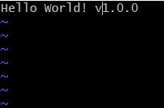
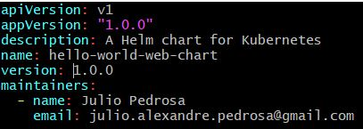
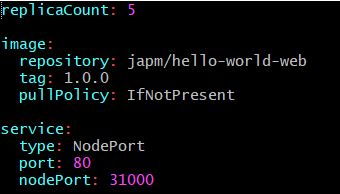

# Zero Downtime Deployment with Kubernetes + HELM :memo:

This repository is intended to teach how to rollout changes a Docker HelloWorld image into the Kubernetes clusters.

If you are here just for fun or learning, you will need to machines, [Just 4Fun](https://github.com/japm94/risk.ident/blob/master/README.md#just-4fun-space_invader-video_game-game_die)

## Prerequisites :world_map:

- kubectl client configured (In other words, you need to have a k8s cluster.)
- Helm installed (Helm initialized in the cluster)

## Intalling App :inbox_tray:
PS: By default the app deployed version will be v1.0.0

1. Installing:
```
$ cd hello-world-web-chart/
$ helm install --name hello-world-web .
```
2. Check Installation:
```
http://<your ip address>:31000
```

## Creating Docker Image :whale:

1. Change the file version:
```
vi app/index.html
```


2. Building Image:
```
$ docker build -t hello-world-web:<VERSION> .
```
3. Tagging the Image:
```
$ docker tag <IMAGE ID> <DOCKERHUB USER>/hello-world-web:<VERSION>
```
4. Pushing to your repository:
```
$ docker push <DOCKERHUB USER>/hello-world-web:<VERSION>
```
5. Testing Docker image:
```
$ docker run -d -p80:80 <DOCKERHUB USER>/hello-world-web:<VERSION>
```
6. Now follow the steps bellow


## ZeroDownTime Rollout :alarm_clock:
PS: Before rolling out update login in another terminal of your cluster and run the command bellow:
```
$ while true; do  curl 0:31000; sleep 1s;
```

1. Change the configurations according to your container in values.yml:
```
$ cd hello-world-web-chart/
$ vi values.yml
```


2. Edit Chart.yml with new versions of the application:
```
$ vi Chart.yml
```


3. Upgrading the app:
```
$ helm upgrade hello-world-web .
```

4. Check the version at the other terminal and the current terminal:
```
$ helm list
NAME            REVISION        UPDATED                         STATUS          CHART                           APP VERSION     NAMESPACE
hello-world-web 2               Fri May 24 16:55:54 2019        DEPLOYED        hello-world-web-chart-2.0.0     2.0.0           default
```

## Helm Rollback :rewind:
1. Check the revision number:
```
$ helm history hello-world-web
REVISION        UPDATED                         STATUS          CHART                           DESCRIPTION
1               Fri May 24 16:29:23 2019        SUPERSEDED      hello-world-web-chart-1.0.0     Install complete
2               Fri May 24 16:55:54 2019        DEPLOYED        hello-world-web-chart-2.0.0     Upgrade complete
```
2. Use the revision number in the command bellow:
```
$ helm rollback hello-world-web <REVISION NUMBER>
```

## Deleting :x:
```
helm del --purge hello-world-web
```

## Just 4Fun :space_invader: :video_game: :game_die:
### Prerequisites :world_map:
- [Vagrant](https://www.vagrantup.com/docs/installation/)
- [Virtual Box](https://www.virtualbox.org/wiki/Downloads)
- [Ansible](https://docs.ansible.com/ansible/2.4/intro_installation.html)

```
$ cd k8s-cluster/
$ vagrant up
$ vagrant ssh k8s-master
$ vagrant@k8s-master:~$ kubectl get nodes
NAME         STATUS   ROLES    AGE     VERSION
k8s-master   Ready    master   18m     v1.13.3
node-1       Ready    <none>   12m     v1.13.3
node-2       Ready    <none>   6m22s   v1.13.3
```
